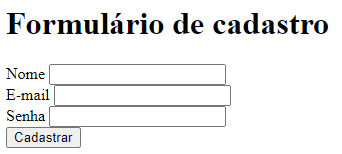

# Sobre a Atividade do modulo HTML 

## Descrição :

- Pode ser acessada entrando na branch: exercicio-html
- A atividade consiste em criar um formulario com nome, senha e um botão para realizar cadastro. Também precisa esta com "label" em cada campo e referenciado com "ID".

